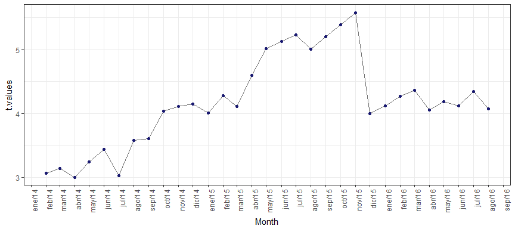

ccharter
========

Control Charts made easy. ccharter focus on calculating control systems in a time series and plotting them as an overlay to the series.

Installation
============

-   You can install from github with:

    ``` r
    if ( !("devtools" %in% installed.packages()) ) {
       install.packages("devtools")
    }
    devtools::install_github("jbaxx/ccharter")
    ```

    Using ccharter
    ==============

The ccharter package comes with two main functions:

-   `ccpoints` to calculate Control Systems points from a time series data frame
-   `cc2plot` to plot the Control Systems points (Control Chart)

Loading the package

``` r
library(ccharter)
```

Calculating the Control Systems points

-   An example usage of `ccpoints`:

``` r
# Create a random time series
set.seed(154)
time.series <- data.frame(t.dates = seq.Date(as.Date("2014-02-01"), as.Date("2016-08-01"), "month"),
               t.values = c(
               seq(0.1, 0.8, by = 0.1) * runif(8) + 3,
               seq(0.1, 0.7, by = 0.1) * runif(7) + 4,
               seq(0.1, 0.7, by = 0.1) * runif(7) + 5,
               seq(0.1, 0.4, by = 0.1) * runif(4) + 4,
               seq(0.1, 0.5, by = 0.1) * runif(5) + 4)
               )

# Execute function
control.chart.data <- ccpoints(time.series, "t.dates", "t.values")
```

If we inspect the object we may find it's a list consisting in:

1.  The first element is the input time series along with the calculated mean and sd for each system
2.  The second element is the name of the dates column
3.  The third element is the name of the values column

``` r
# Inspecting cchart object content
lapply(control.chart.data, head)
#> $data
#>      t.dates t.values data.mean  data.ll  data.ul
#> 1 2014-02-01 3.071129  3.156051 2.991715 3.320387
#> 2 2014-03-01 3.140564  3.156051 2.991715 3.320387
#> 3 2014-04-01 3.008430  3.156051 2.991715 3.320387
#> 4 2014-05-01 3.243547  3.156051 2.991715 3.320387
#> 5 2014-06-01 3.442773  3.156051 2.991715 3.320387
#> 6 2014-07-01 3.029862  3.156051 2.991715 3.320387
#> 
#> $dates.name
#> [1] "t.dates"
#> 
#> $values.name
#> [1] "t.values"
```

To extract the data frame, we can access it from the list in the following way:

``` r
control.chart.data[["data"]]
```

Plotting the Control Systems points

This is how the time series looks like:



-   An example usage of `cc2plot`:

``` r
# Passing the cchart object to the cc2plot function
cc2plot(control.chart.data)
```


For detailed functions documentation you can access the help files in R with `?ccpoints` and `?cc2plot`.
